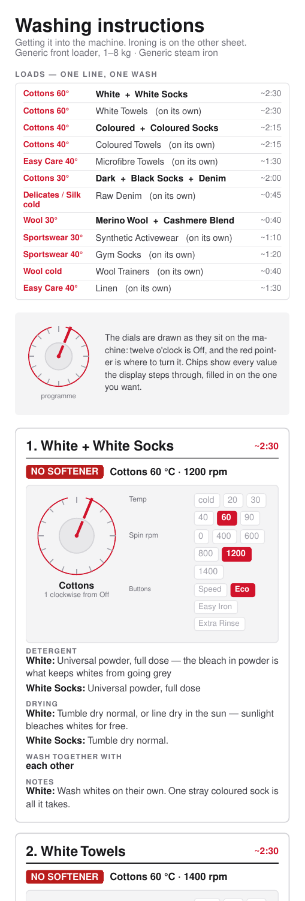
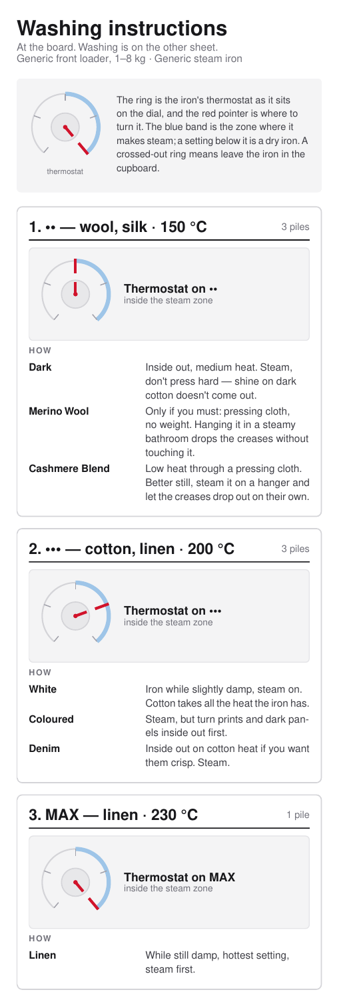
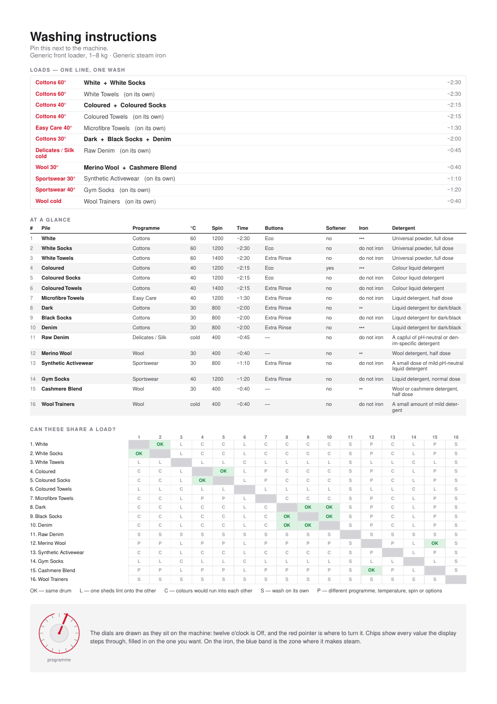
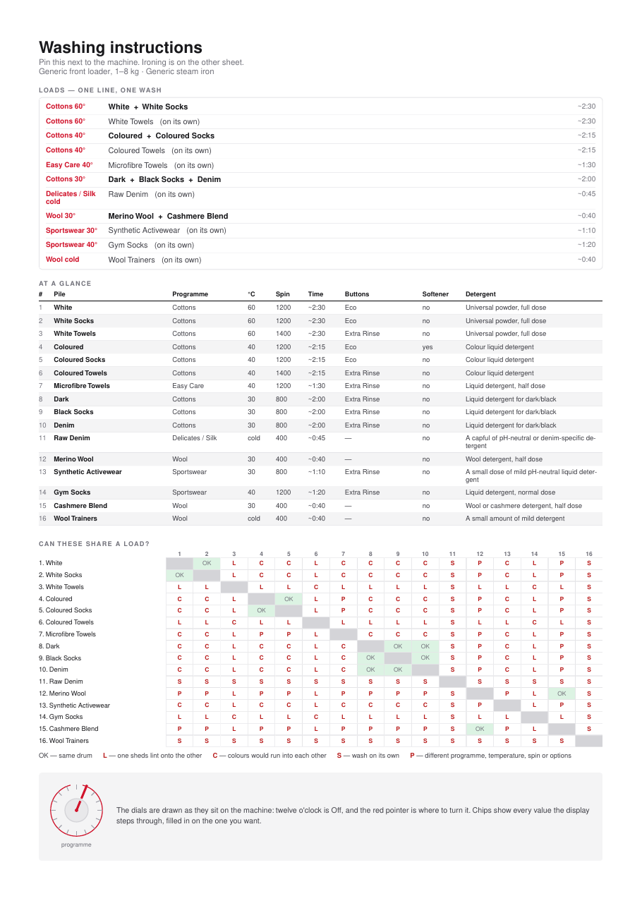
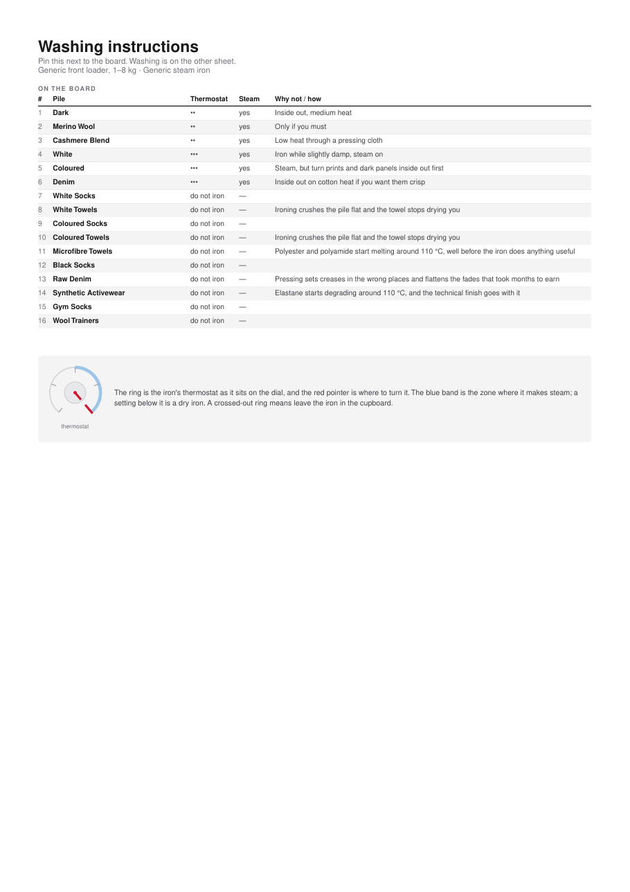

<!--
Maintainer note (not rendered): the licence badge is static because nothing is
published to a registry that could be read for it. Every other badge measures
something real — do not add one that reads "unknown".
-->

[](https://github.com/alrayyes/washy-washy-cli/actions/workflows/ci.yml)
[](https://codecov.io/gh/alrayyes/washy-washy-cli)
[](https://github.com/alrayyes/washy-washy-cli/actions/workflows/release.yml)
[](https://github.com/alrayyes/washy-washy-cli/releases/latest)
[](LICENSE)
[](https://github.com/alrayyes/washy-washy-cli/pkgs/container/washy-washy-cli)

# Washy washy

Nobody remembers whether the towels go in at 40 or 60, which button stops the
black t-shirts coming out streaky, or where on the dial "Fijn/Zijde" actually
is. This turns a CSV of laundry piles into PDFs that answer all of it, in two
shapes:

- **`out/washing-instructions-phone.pdf`** — one tall, narrow page you scroll
  through on your phone while standing in front of the machine.
- **`out/washing-instructions-print.pdf`** — an A4 reference sheet to pin next
  to the machine, followed by a full-page card for each pile.

Each of those also comes cut in half, because the two jobs happen in different
rooms hours apart and neither wants to read past the other to find its own:
`-washing` drops the iron, and `-ironing` drops everything about the machine.
Six files out of one run — see [the split sheets](#the-split-sheets).

Both are drawn for _your_ appliances. You describe the washing machine and the
iron once, in a JSON file, and every card then shows the programme dial with the
pointer where you need to turn it, the temperature and spin values picked out of
the row the display steps through, which option buttons to press, and the iron's
thermostat ring with its steam zone marked. You are not translating generic
advice onto your machine; the drawing _is_ your machine.

Nothing here translates a fascia label, ever. If the dial says `Fijn/Zijde`, the
card says `Fijn/Zijde` — a chart you have to translate back while standing in
front of the machine is worse than no chart. Everything the tool says _about_
the machine is in English; everything printed _on_ the machine is whatever you
typed into the machine file.

It also answers the question that actually causes arguments: what can go in
together. Piles are grouped into loads, each card names its bedfellows, and the
printed sheet carries a full compatibility matrix with the reason for every no.

| The phone sheet, from the top                                                                                                                                                   | A card from the printable set                                                                                                                                                                                                                 |
| ------------------------------------------------------------------------------------------------------------------------------------------------------------------------------- | --------------------------------------------------------------------------------------------------------------------------------------------------------------------------------------------------------------------------------------------- |
|  |  |

That is the committed example chart, not anyone's real laundry. Every sheet it
draws is here to open, so you can read the whole thing rather than a picture of
the top of it. All six come from the generic appliances in
`data/machine.json.dist`.

**On the phone**, top of each sheet:

<p>
  <a href="docs/washing-instructions-phone.pdf"></a>
  <a href="docs/washing-instructions-phone-washing.pdf"></a>
  <a href="docs/washing-instructions-phone-ironing.pdf"></a>
</p>

**Printable**, the reference sheet each one opens with:

<p>
  <a href="docs/washing-instructions-print.pdf"></a>
  <a href="docs/washing-instructions-print-washing.pdf"></a>
  <a href="docs/washing-instructions-print-ironing.pdf"></a>
</p>

Every picture is a link to the PDF it came out of. The printable ones open on
the reference sheet; the detail cards follow it.

A test redraws all six and compares them page by page against what is
committed, so the one you open is what the current chart draws, not what it
drew whenever someone last remembered to redraw them.

## Requirements

- **[Bun](https://bun.sh) 1.3 or newer** — runtime, package manager and test
  runner. Nothing else is needed; there is no build step and no browser.
- Linux, macOS or WSL. Bun's Windows support should work but is untested here.

No network access is needed at run time, and no fonts are downloaded: the PDFs
use the Helvetica that every PDF reader already has.

## Installation

```sh
bun install --frozen-lockfile
cp data/machine.json.dist data/machine.json             # then describe your appliances
cp data/washing-instructions.csv.dist data/washing-instructions.csv
```

Neither copy is required. With no files of your own the tool reads the two
committed `.dist` examples, so `bun run generate` works on a fresh clone and
produces a chart for a machine that is not yours — useful for seeing the shape
of the thing, useless for actually doing laundry.

## Usage

Generate every PDF from the bundled data:

```sh
bun run generate
```

```text
Read 16 piles from /home/you/washy-washy/data/washing-instructions.csv.dist
  drawn for Generic front loader · Generic steam iron
  out/washing-instructions-phone.pdf  one page, 6225 pt tall (11 layout passes)
  out/washing-instructions-print.pdf
  out/washing-instructions-phone-washing.pdf  one page, 4272 pt tall (10 layout passes)
  out/washing-instructions-print-washing.pdf
  out/washing-instructions-phone-ironing.pdf  one page, 900 pt tall (9 layout passes)
  out/washing-instructions-print-ironing.pdf

Piles that can share a drum:
  White + White Socks           ~2:30
  Coloured + Coloured Socks     ~2:15
  Dark + Black Socks + Denim    ~2:00
  Merino Wool + Cashmere Blend  ~0:40

Set up identically on both appliances, so sharing one card:
  Merino Wool + Cashmere Blend
```

Point it at your own file, at different appliances, or somewhere else for the
output:

```sh
bun run generate my-laundry.csv --machine my-machine.json --out ~/Documents
```

The output filenames follow the input, so `my-laundry.csv` gives you
`my-laundry-phone.pdf`, `my-laundry-print.pdf` and the four split sheets
beside them.

### The split sheets

Washing and ironing are the same chart read at two different moments. You stand
at the machine on a Sunday morning wanting a programme, a temperature and a
spin speed; you stand at the board on a Wednesday evening wanting a thermostat
position. Carrying the other half of the advice to either place is what makes a
card too long to read, so each run writes both halves and the whole thing.

**`-washing`** drops the iron block from every card and the iron column from the
reference sheet. It also merges harder. Dark, Black Socks and Denim each need
their own card on the full chart only because they want three different
thermostat positions — with the iron gone they are one wash and one card.

**`-ironing`** turns the chart inside out. The heading is the thermostat
position rather than the pile, because that is the order you actually work in:
set the iron once, then go through everything that goes at that heat. Piles that
are never ironed gather on a last card of their own, which is worth printing —
"is this safe to press" is the question that ruins a shirt.

Neither is a subset you could have got by folding a printout. The grouping is
different, the tables carry different columns, and the phone sheet is measured
to its own height.

### Without installing anything

You can run it with nothing on the machine but Docker. Every release publishes
an image, so there is nothing to build — mount a directory on `/out` and the
PDFs land there:

```sh
docker run --rm \
  --cap-drop=ALL --security-opt=no-new-privileges --read-only \
  --memory=256m --cpus=1 \
  -v "$PWD/out:/out" \
  ghcr.io/alrayyes/washy-washy-cli
```

Nothing in here needs a Linux capability or a writable root filesystem, so it
costs nothing to ask for none: `--cap-drop=ALL` and `--read-only` need no
matching `--cap-add` or `tmpfs` mount anywhere in this image, and the memory
and CPU limits are generous for a job this small. The rest of this section
drops those flags for readability — they carry through every example below
unchanged.

`latest` follows the newest release, and every release also answers to its full
version and to the loose ends of it — `:1.0.0`, `:1.0`, `:1` — so a compose file
can say how much drift it is willing to take. Images are built for `amd64` and
`arm64`, and each one carries a signed provenance attestation tying it to the
workflow run and commit that produced it:

```sh
gh attestation verify oci://ghcr.io/alrayyes/washy-washy-cli:latest \
  --repo alrayyes/washy-washy-cli
```

Building it yourself works the same way:

```sh
docker build -t washy-washy .
docker run --rm -v "$PWD/out:/out" washy-washy
```

That uses the dummy chart baked into the image. To chart your own laundry,
mount it over the top and name it — everything after the image name goes
straight to the CLI:

```sh
docker run --rm \
  -v "$PWD/out:/out" \
  -v "$PWD/data/washing-instructions.csv:/app/data/mine.csv:ro" \
  ghcr.io/alrayyes/washy-washy-cli data/mine.csv
```

Your appliances go in the same way, since the image carries only the example
pair:

```sh
docker run --rm \
  -v "$PWD/out:/out" \
  -v "$PWD/data/machine.json:/app/data/machine.json:ro" \
  -v "$PWD/data/washing-instructions.csv:/app/data/washing-instructions.csv:ro" \
  ghcr.io/alrayyes/washy-washy-cli
```

The container runs as an unprivileged user, so the PDFs come out owned by
`1000:1000` rather than by root. If that is not your own ID, `--user "$(id
-u):$(id -g)"` fixes the ownership on the way out.

## The CSV

One row per pile. Adding a pile never needs a code change.

The chart that ships with the repo is
[`data/washing-instructions.csv.dist`](data/washing-instructions.csv.dist), and
it is a made-up one — nobody's actual wardrobe. Yours goes in
`data/washing-instructions.csv` beside it, which is gitignored, so your laundry
never lands in a commit. Copy the dist across and edit it:

```sh
cp data/washing-instructions.csv.dist data/washing-instructions.csv
```

There is no need to hurry: with no file of your own, `bun run generate` reads
the dist and says so.

| Column            | What goes in it                                                         |
| ----------------- | ----------------------------------------------------------------------- |
| `clothing_type`   | What you call the pile — this is the card heading                       |
| `detergent`       | Which detergent and how much                                            |
| `fabric_softener` | `yes` or `no`                                                           |
| `temperature`     | A temperature your machine offers                                       |
| `spin`            | A spin speed your machine offers                                        |
| `duration`        | Roughly how long it runs — on the loads table, the summary and the card |
| `program`         | A dial position, spelled exactly as on the fascia                       |
| `options`         | Option buttons, pipe-separated; empty for none                          |
| `ironing`         | `yes` or `no` — whether you iron it at all                              |
| `ironing_notes`   | Prose: how to iron it, or why you don't. Often empty                    |
| `iron_setting`    | A thermostat position. Empty when `ironing` is `no`                     |
| `drying`          | Prose: how to dry it                                                    |
| `colour_group`    | `white`, `colour`, `dark`, `sport` or `any`                             |
| `mix_tags`        | Pipe-separated: `lint-shedder`, `lint-magnet`, `dye-bleeder`, `solo`    |
| `notes`           | Anything else worth knowing                                             |

Every machine-facing value is checked against what the appliances can actually
be set to, so a typo fails the run rather than producing a PDF that tells you
to turn the dial somewhere it does not go:

```text
row 8, column "program": "Cottons" is not one of Uit, Katoen, Katoen + Voorwas, ...
```

[`data/washing-instructions.schema.json`](data/washing-instructions.schema.json)
says the same thing in a form other
tools understand: a [Frictionless Table
Schema](https://datapackage.org/standard/table-schema/) naming every column, its
type, and the values it accepts. Point a validator at the pair and it tells you
which row is wrong; point an editor at it and you get the programme names in an
autocomplete rather than in another window.

It is generated, never edited — `packages/core/src/machine.ts` stays the one
authority on the appliances, and a second copy of those lists would drift the
first time a programme is renamed:

```sh
bun run schema   # after changing packages/core/src/machine.ts
```

A test compares the committed file against what the generator produces, so
forgetting that command fails CI rather than leaving a schema that quietly
disagrees with the parser.

### Let a chatbot write the first draft

Filling in fifteen rows of care advice from scratch is the tedious part, and it
is the part a language model is genuinely good at. Paste it the dist file as the
format, your `data/machine.json` as the only values it may use, and a
description of what you actually own — a flat share with two sets of bed linen
and a lot of running kit is a different chart from a household with school
uniforms.

Give it the machine file whole rather than retyping the lists out of it. Every
value it is allowed to write is in there, and it is the same file the validator
will judge the answer against.

Something like this works:

```text
Here is a CSV format with an example row, and the JSON file describing my
appliances. Write me one row per pile for the laundry I describe.

Every machine-facing value has to come out of that file: program from
washer.programs, temperature from washer.temperatures, spin from washer.spins,
options from washer.options, and iron_setting from an iron.settings key. Spell
them exactly as they appear there.

ironing is yes or no. When it is no, leave iron_setting empty.

duration is roughly how long that programme runs on my machine, as ~H:MM.

My laundry: <describe it — fabrics, colours, what you own a lot of, what you
line dry, anything with a care label you actually follow>.
```

Two things to do with the answer. Run it: the CSV validator checks every
machine-facing value against the machine file you load, so an invented
programme name fails the run rather than reaching a PDF. Then read it: a model
will state a wash temperature with total confidence and be wrong, so check
anything that would ruin a garment — wool, silk, anything with elastane —
against the care label or the maker's own guidance before you trust the chart
taped to your machine. The durations are guesses too, and yours are on the
display.

### How "can these wash together" is decided

Two piles may share a drum only when all of these hold. The first one that
fails is the reason shown in the matrix.

1. Neither is tagged `solo`. Raw denim and trainers go in alone, full stop.
2. If either is a `lint-shedder`, the other must be too — terry sheds over
   everything, so towels only ever go with towels.
3. Their `colour_group` matches (`any` matches everything).
4. Programme, temperature, spin _and_ the set of option buttons are identical.

Rule 4 is why White and White Socks share a load, but White Towels do not: the
towels want 1400 rpm and an extra rinse, which is a different wash even though
the temperature agrees.

### One card for several piles

Sharing a load still gets you a card each. Dark, Black Socks and Denim wash
identically but want a two-dot iron, no iron and a three-dot iron respectively,
so the iron drawing alone justifies three cards.

Piles merge onto one card when everything you physically _set_ agrees:
programme, temperature, spin, option buttons, whether softener goes in, and
where the iron's thermostat points. Every dial drawing would be the same
drawing, so one card carries all the names — Merino Wool and Cashmere Blend, for
instance.

Prose is deliberately not part of that key. Those two want different detergent
and different drying, and the card lists both lines against the pile they belong
to rather than letting one stand in for the other.

The washing-only sheet drops the thermostat from that key and the ironing-only
sheet keeps nothing else, which is why the same chart draws a different number
of cards on each. See [the split sheets](#the-split-sheets).

## Your appliances

The machine is data, not code. `data/machine.json.dist` describes a generic
front loader and a generic steam iron; yours goes in `data/machine.json` beside
it, which is gitignored like the chart:

```sh
cp data/machine.json.dist data/machine.json
```

Inside are the dial labels in physical order, the temperatures and spin speeds
the display offers, the option buttons, and the iron's thermostat positions.
Copy each label exactly as it is printed in front of you, in whatever language
that is — the whole point is that the drawing matches the machine.

Two things follow from the order of `programs`. The first entry is the off
position and is drawn at twelve o'clock, and every other tick takes its angle
from where it sits in the list, so a programme left out does not merely go
missing: it moves all the others. `temperatures` are printed as they stand,
except that a plain number gets a degree sign, which is why a machine whose
display says `cold` or `koud` needs no special case anywhere in the code.

[`data/machine.schema.json`](data/machine.schema.json) describes the file, and
the `$schema` line at the top of the `.dist` points at it, so an editor will
complete the fields and complain before the tool does. `bun run lint:machine`
checks the committed `.dist` against it too, so a schema that drifts from the
file it documents fails the pipeline rather than only misleading an editor. The
CSV validator takes its allowed values from whichever machine you load, so a
chart written for one machine is refused by another rather than silently drawn
wrong:

```text
row 2, column "program": "Cottons" is not one of Uit, Katoen, Katoen + Voorwas, ...
```

### Let a chatbot read your machine off a photo

Typing out sixteen dial labels in a language you may not read is the tedious
part, and you do not have to. Take a photo of the fascia and a photo of the
iron's thermostat ring, paste them to a chatbot along with
[`data/machine.schema.json`](data/machine.schema.json) and the `.dist` file as
the format, and ask for the same file for your appliances.

A photo beats describing it here, and for a reason specific to this tool. The
order of `programs` is load-bearing — every tick's angle comes from where it
sits in the list — and a photo has that order in it. Describe the same dial in
words, and you will almost certainly list the programmes in an order that makes
sense rather than the order they go round.

Something like this works:

```text
Attached is a photo of my washing machine's fascia and one of my iron's
thermostat, plus a JSON schema and an example file. Write me the same file for
these appliances.

Copy every label exactly as printed, in whatever language it is in. Do not
translate any of them into English, and do not tidy up the spelling or the
punctuation.

washer.programs is the dial, listed in the order the positions go round it,
starting at the off position. Read that order off the dial rather than
grouping the programmes sensibly.
```

Then check it against the machine before you run it, because two things go
wrong. Small or angled text gets misread, so the labels are worth reading back
one by one. And nothing in a photo says which position is off — the model has
to guess, and if it guesses wrong every dial in every PDF is rotated. Start at
the off position and go clockwise yourself.

After that, run it. `parseMachine` refuses a file that is missing a field or
repeats a programme, and the CSV validator then refuses a chart written for
your old machine, naming the first row that no longer fits. That second one is
the useful failure when you replace an appliance: the chart does not silently
draw the wrong dial, it stops and tells you which rows need new programme
names.

## The web app

Live at [washy-washy.ryankes.eu](https://washy-washy.ryankes.eu).

`apps/web` is a static [Astro](https://astro.build) site — a bookmarkable,
Android-installable page reading the same `.dist` chart. It shows the phone
sheet as a real page — the same cards, dial illustrations and colours the
PDF draws, as HTML/CSS/SVG rather than an embedded PDF viewer — filtered by
cut (everything, washing only, ironing only) and by pile (a search over the
clothing type). The PDF itself, drawn through the same `@react-pdf/renderer`
components and height-bisection pass the CLI's phone PDF uses, is only
generated when you click "Download this sheet as a PDF" — not on every
filter change.

Your last cut and pile filter are saved in the browser's `localStorage`, under
the key `washy-washy:filters`, so reopening the page (or the installed
home-screen icon) picks up where you left off. That's the only thing the site
stores, it never leaves the device, and there's no account or server it could
sync to — clear it the way you'd clear any site's data, or just use the
filters and it saves itself. Where storage isn't available at all (private
browsing, a full quota), the page still works; it just starts back at the
default view every time.

The same filters are also in the URL — `?cut=iron&pile=towels` — so copying
the address bar and sending it to someone opens straight to that view, no
description of which dropdown and search term needed. A URL carrying filter
state always wins over whatever `localStorage` remembers from a previous
visit, and the URL updates as you filter without adding to your browser's
back-button history. The uploaded chart itself isn't part of the URL — its
JSON is too large for that — so sharing your own chart still means sending
the downloaded file, not a link.

You can also upload your own chart instead of the bundled example: a JSON
array of rows in the exact shape `data/washing-instructions.schema.json`
describes — the same shape `packages/core`'s `chartToJson` writes and
`chartFromJson` reads, and the same one a CSV parses into, just with the
CSV's `|`-joined lists as real JSON arrays. "Download this chart as JSON" writes that
shape out for whatever chart is currently active, bundled or your own, so
editing a downloaded file and re-uploading it round-trips cleanly. A file
that fails validation is rejected with the same row/column error the CLI's
CSV validator gives, and the upload itself never leaves the browser —
there's no server or account behind it, storage-permitting; clearing it (or
using a private/storage-restricted browser) falls back to the bundled chart
rather than showing nothing.

The [`/config`](https://washy-washy.ryankes.eu/config) page shows the whole
loaded config in one place — every washer programme, temperature, spin and
button, the iron's thermostat positions, and every pile in the chart — for
checking or troubleshooting what the site is actually working from. It's
read-only and reflects whichever chart is active, bundled or uploaded, the
same way the main page does.

```sh
cd apps/web
bun run dev              # local dev server
bun run build            # static output in apps/web/dist
bun run check            # astro check — this app's own typecheck, separate
                          # from the CLI's, since .astro files need Astro's
                          # own TS plugin
bun run test:e2e         # Playwright, against a real build — see apps/web/
                          # e2e/ and playwright.config.ts. First run needs
                          # `bunx playwright install --with-deps chromium`.
bun run deploy           # ship apps/web/dist to production
bun run deploy:version   # upload a preview version without promoting it
```

It shares `packages/core` — the chart parsing, mixing rules and machine
validation — with the CLI, so a rule change lands in both at once. Deploys as
a Cloudflare Worker serving static assets (`apps/web/wrangler.jsonc`), built
and shipped by Cloudflare's own Git integration — a build on `main` deploys
straight to production, a pull request uploads a preview version instead.

## Contributing

Everything about working on this — the commands, the linters, the tests, the git
hooks and how a release is cut — is in [CONTRIBUTING.md](CONTRIBUTING.md). Short
version: `bun run check` before you push, commit under
[Conventional Commits](https://www.conventionalcommits.org/), and say in the
commit body where a changed wash setting came from. Care advice is sourced, not
guessed.

## Where the current advice comes from

The bundled data was assembled from manufacturer and trade guidance:
[Which? on wash temperatures](https://www.which.co.uk/reviews/washing-machines/article/washing-machine-temperature-guide-aLiyf2p96y4d),
[Icebreaker on merino](https://eu.icebreaker.com/en-gb/blogs/journal/how-to-wash-merino-wool-jumper),
[Hiut Denim](https://hiutdenim.co.uk/pages/washing-instructions) and
[Blue Owl Workshop](https://www.blueowl.us/blogs/news/how-to-wash-your-raw-denim-selvedge-jeans)
on raw selvedge,
[Peacock Alley on towels](https://www.peacockalley.com/pages/towel-care-guide),
[Tefal's Easygliss Plus manual](https://www.tefal.com/instructions-for-use/csp/1830007452)
for the thermostat markings, and
[Dirty Labs](https://dirtylabs.com/blogs/the-dirt/how-to-wash-your-activewear)
on synthetic activewear.

## Licence

[GNU General Public License v3.0 or later](LICENSE). Use it, change it, pass it
on — but anything you distribute that is built on it comes with the same freedom
attached, source included.

The care advice in `data/washing-instructions.csv.dist` is assembled from the
manufacturer and trade sources listed above, and is offered in the same spirit
as the code: no warranty. Your care labels outrank it.
