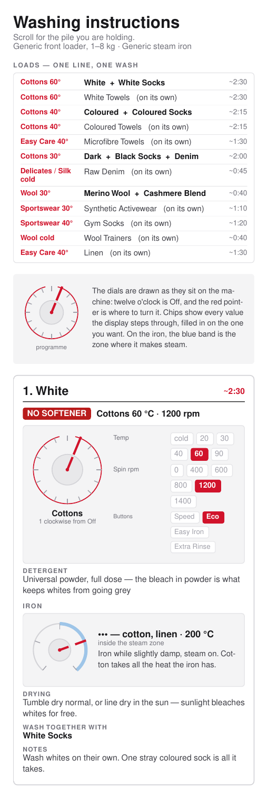
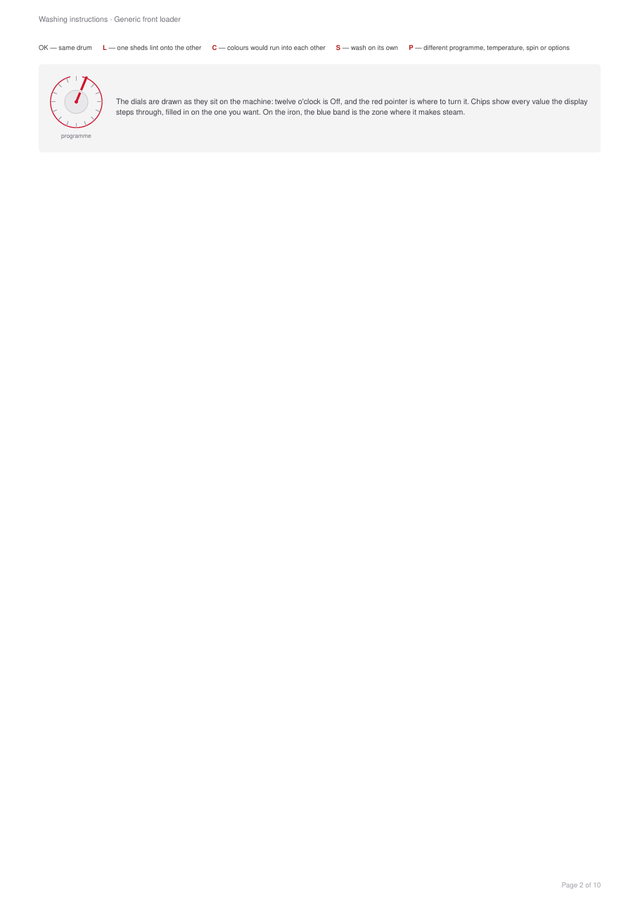

<!--
Maintainer note (not rendered): the licence badge is static because nothing is
published to a registry that could be read for it. Every other badge measures
something real — do not add one that reads "unknown".
-->

[](https://github.com/alrayyes/washing-instructions/actions/workflows/ci.yml)
[](https://github.com/alrayyes/washing-instructions/actions/workflows/release.yml)
[](https://github.com/alrayyes/washing-instructions/releases/latest)
[](LICENSE)

# Washing instructions

Nobody remembers whether the towels go in at 40 or 60, which button stops the
black t-shirts coming out streaky, or where on the dial "Fijn/Zijde" actually
is. This turns a CSV of laundry piles into two PDFs that answer all of it:

- **`out/washing-instructions-phone.pdf`** — one tall, narrow page you scroll
  through on your phone while standing in front of the machine.
- **`out/washing-instructions-print.pdf`** — an A4 reference sheet to pin next
  to the machine, followed by a full-page card for each pile.

Both are drawn for _your_ appliances. You describe the washing machine and the
iron once, in a JSON file, and every card then shows the programme dial with the
pointer where you need to turn it, the temperature and spin values picked out of
the row the display steps through, which option buttons to press, and the iron's
thermostat ring with its steam zone marked. You are not translating generic
advice onto your machine; the drawing _is_ your machine.

Nothing here translates a fascia label, ever. If the dial says `Fijn/Zijde`, the
card says `Fijn/Zijde` — a chart you have to translate back while standing in
front of the machine is worse than no chart. Everything the tool says _about_
the machine is in English; everything printed _on_ the machine is whatever you
typed into the machine file.

It also answers the question that actually causes arguments: what can go in
together. Piles are grouped into loads, each card names its bedfellows, and the
printed sheet carries a full compatibility matrix with the reason for every no.

| The phone sheet, from the top                                                                                                                 | A card from the printable set                                                                                                                                                            |
| --------------------------------------------------------------------------------------------------------------------------------------------- | ---------------------------------------------------------------------------------------------------------------------------------------------------------------------------------------- |
|  |  |

Both are the committed example chart, not anyone's real laundry. The PDFs
themselves come out of every run, so you can read the real thing rather than a
picture of it: open the newest
[run of `check` on `main`](https://github.com/alrayyes/washing-instructions/actions/workflows/ci.yml?query=branch%3Amain)
and take the `washing-instructions-pdfs` artifact from the bottom of the page.
Downloading one needs a GitHub account — the artifact API asks anyone for a
token, which is why these are a link to the run rather than to the file.

## Requirements

- **[Bun](https://bun.sh) 1.3 or newer** — runtime, package manager and test
  runner. Nothing else is needed; there is no build step and no browser.
- Linux, macOS or WSL. Bun's Windows support should work but is untested here.
- Optional, for the git hooks: nothing extra — `lefthook` and the linters
  install as dev dependencies. Vale is the exception, because it is a Go binary
  rather than a package: `bun run prose:sync` fetches it into `.tools/`, checks
  it against the release's own checksums, and pulls down the style packages it
  lints against. That wants network access and `tar`, once.

No network access is needed at run time, and no fonts are downloaded: the PDFs
use the Helvetica that every PDF reader already has.

## Installation

```sh
bun install --frozen-lockfile
cp data/machine.json.dist data/machine.json             # then describe your appliances
cp data/washing-instructions.csv.dist data/washing-instructions.csv
bunx lefthook install   # only if you intend to commit
bun run prose:sync      # only if you intend to commit
```

Neither copy is required. With no files of your own the tool reads the two
committed `.dist` examples, so `bun run generate` works on a fresh clone and
produces a chart for a machine that is not yours — useful for seeing the shape
of the thing, useless for actually doing laundry.

## Usage

Generate both PDFs from the bundled data:

```sh
bun run generate
```

```text
Read 15 piles from /home/you/washing-instructions/data/washing-instructions.csv.dist
  drawn for Generic front loader · Generic steam iron
  out/washing-instructions-phone.pdf  one page, 5818 pt tall (10 layout passes)
  out/washing-instructions-print.pdf

Piles that can share a drum:
  White + White Socks
  Coloured + Coloured Socks
  Dark + Black Socks + Denim
  Merino Wool + Cashmere Blend

Set up identically on both appliances, so sharing one card:
  Merino Wool + Cashmere Blend
```

Point it at your own file, at different appliances, or somewhere else for the
output:

```sh
bun run generate my-laundry.csv --machine my-machine.json --out ~/Documents
```

The output filenames follow the input, so `my-laundry.csv` gives you
`my-laundry-phone.pdf` and `my-laundry-print.pdf`.

### Without installing anything

There is a `Dockerfile`, so you can run it with nothing on the machine but
Docker. Mount a directory on `/out` and the PDFs land there:

```sh
docker build -t washing-instructions .
docker run --rm -v "$PWD/out:/out" washing-instructions
```

That uses the dummy chart baked into the image. To chart your own laundry,
mount it over the top and name it — everything after the image name goes
straight to the CLI:

```sh
docker run --rm \
  -v "$PWD/out:/out" \
  -v "$PWD/data/washing-instructions.csv:/app/data/mine.csv:ro" \
  washing-instructions data/mine.csv
```

The container runs as an unprivileged user, so the PDFs come out owned by
`1000:1000` rather than by root. If that is not your own ID, `--user "$(id
-u):$(id -g)"` fixes the ownership on the way out.

## The CSV

One row per pile. Adding a pile never needs a code change.

The chart that ships with the repo is
[`data/washing-instructions.csv.dist`](data/washing-instructions.csv.dist), and
it is a made-up one — nobody's actual wardrobe. Yours goes in
`data/washing-instructions.csv` beside it, which is gitignored, so your laundry
never lands in a commit. Copy the dist across and edit it:

```sh
cp data/washing-instructions.csv.dist data/washing-instructions.csv
```

There is no need to hurry: with no file of your own, `bun run generate` reads
the dist and says so.

| Column            | What goes in it                                                      |
| ----------------- | -------------------------------------------------------------------- |
| `clothing_type`   | What you call the pile — this is the card heading                    |
| `detergent`       | Which detergent and how much                                         |
| `fabric_softener` | `yes` or `no`                                                        |
| `temperature`     | A temperature your machine offers                                    |
| `spin`            | A spin speed your machine offers                                     |
| `duration`        | Roughly how long it runs, for planning                               |
| `program`         | A dial position, spelled exactly as on the fascia                    |
| `options`         | Option buttons, pipe-separated; empty for none                       |
| `ironing`         | Prose: how to iron it                                                |
| `iron_setting`    | A thermostat position, or `none` for do not iron                     |
| `drying`          | Prose: how to dry it                                                 |
| `colour_group`    | `white`, `colour`, `dark`, `sport` or `any`                          |
| `mix_tags`        | Pipe-separated: `lint-shedder`, `lint-magnet`, `dye-bleeder`, `solo` |
| `notes`           | Anything else worth knowing                                          |

Every machine-facing value is checked against what the appliances can actually
be set to, so a typo fails the run rather than producing a PDF that tells you
to turn the dial somewhere it does not go:

```text
row 8, column "program": "Cottons" is not one of Uit, Katoen, Katoen + Voorwas, ...
```

[`data/washing-instructions.schema.json`](data/washing-instructions.schema.json)
says the same thing in a form other
tools understand: a [Frictionless Table
Schema](https://datapackage.org/standard/table-schema/) naming every column, its
type, and the values it accepts. Point a validator at the pair and it tells you
which row is wrong; point an editor at it and you get the programme names in an
autocomplete rather than in another window.

It is generated, never edited — `src/machine.ts` stays the one authority on the
appliances, and a second copy of those lists would drift the first time a
programme is renamed:

```sh
bun run schema   # after changing src/machine.ts
```

A test compares the committed file against what the generator produces, so
forgetting that command fails CI rather than leaving a schema that quietly
disagrees with the parser.

### Let a chatbot write the first draft

Filling in fifteen rows of care advice from scratch is the tedious part, and it
is the part a language model is genuinely good at. Paste it the dist file as the
format, the list of programmes and settings out of `src/machine.ts` as the only
values it may use, and a description of what you actually own — a flat share
with two sets of bed linen and a lot of running kit is a different chart from a
household with school uniforms.

Something like this works:

```text
Here is a CSV format and an example row. Write me one row per pile for the
laundry I describe. Only use these programmes: <paste washer.programs>. Only
these temperatures: <paste>. Only these spin speeds: <paste>. Only these option
buttons: <paste>. iron_setting must be one of none, min, 1, 2, 3, max.

My laundry: <describe it — fabrics, colours, what you own a lot of, what you
line dry, anything with a care label you actually follow>.
```

Two things to do with the answer. Run it: the CSV validator checks every
machine-facing value against `src/machine.ts`, so an invented programme name
fails the run rather than reaching a PDF. Then read it: a model will state a
wash temperature with total confidence and be wrong, so check anything that
would ruin a garment — wool, silk, anything with elastane — against the care
label or the maker's own guidance before you trust the chart taped to your
machine.

### How "can these wash together" is decided

Two piles may share a drum only when all of these hold. The first one that
fails is the reason shown in the matrix.

1. Neither is tagged `solo`. Raw denim and trainers go in alone, full stop.
2. If either is a `lint-shedder`, the other must be too — terry sheds over
   everything, so towels only ever go with towels.
3. Their `colour_group` matches (`any` matches everything).
4. Programme, temperature, spin _and_ the set of option buttons are identical.

Rule 4 is why White and White Socks share a load, but White Towels do not: the
towels want 1400 rpm and an extra rinse, which is a different wash even though
the temperature agrees.

### One card for several piles

Sharing a load still gets you a card each. Dark, Black Socks and Denim wash
identically but want a two-dot iron, no iron and a three-dot iron respectively,
so the iron drawing alone justifies three cards.

Piles merge onto one card when everything you physically _set_ agrees:
programme, temperature, spin, option buttons, whether softener goes in, and
where the iron's thermostat points. Every dial drawing would be the same
drawing, so one card carries all the names — Merino Wool and Cashmere Blend, for
instance.

Prose is deliberately not part of that key. Those two want different detergent
and different drying, and the card lists both lines against the pile they belong
to rather than letting one stand in for the other.

## Your appliances

The machine is data, not code. `data/machine.json.dist` describes a generic
front loader and a generic steam iron; yours goes in `data/machine.json` beside
it, which is gitignored like the chart:

```sh
cp data/machine.json.dist data/machine.json
```

Inside are the dial labels in physical order, the temperatures and spin speeds
the display offers, the option buttons, and the iron's thermostat positions.
Copy each label exactly as it is printed in front of you, in whatever language
that is — the whole point is that the drawing matches the machine.

Two things follow from the order of `programs`. The first entry is the off
position and is drawn at twelve o'clock, and every other tick takes its angle
from where it sits in the list, so a programme left out does not merely go
missing: it moves all the others. `temperatures` are printed as they stand,
except that a plain number gets a degree sign, which is why a machine whose
display says `cold` or `koud` needs no special case anywhere in the code.

[`data/machine.schema.json`](data/machine.schema.json) describes the file, and
the `$schema` line at the top of the `.dist` points at it, so an editor will
complete the fields and complain before the tool does. The CSV validator takes
its allowed values from whichever machine you load, so a chart written for one
machine is refused by another rather than silently drawn wrong:

```text
row 2, column "program": "Cottons" is not one of Uit, Katoen, Katoen + Voorwas, ...
```

## Development

```sh
bun run check              # every linter, tsc --noEmit, then the tests
bun run format:md          # let Prettier lay the Markdown out
bun run lint:prose:advice  # Vale's style advice, warnings and all
bun test                   # just the tests
```

Two formatters, split by file type and never overlapping. Biome owns everything
it supports; Markdown is the one thing it does not format, so that goes to
Prettier and `.prettierignore` names the file types Prettier must keep its hands
off. Prettier runs before markdownlint, never after — Prettier decides the
layout and markdownlint judges what came out, so the rules the two would argue
over (list markers, list indentation, emphasis characters) are switched off on
markdownlint's side.

### The prose is linted too

The README is the whole manual for this thing, so it gets checked the way the
code does. markdownlint only judges structure — headings, list markers, blank
lines — and happily passes a document that says `an unique setting`. Two more
tiers sit over it, and they are deliberately answered differently. The specimen
in the last sentence is in backticks because otherwise the mechanics tier finds
it, which is the point:

- **Mechanics** — [LTeX+](https://github.com/ltex-plus/ltex-ls-plus) wrapping
  LanguageTool: grammar, spelling, punctuation, the phonetic article. These have
  a right answer, so the `ltex` job blocks the run. It reports findings
  with exit code **3**, not 1, which is worth knowing before you write anything
  that tests for a number. It stays out of the git hooks because it is a 300 MB
  download carrying its own Java runtime; run the same engine in your editor
  over LSP and CI is only the fallback.
- **Style** — [Vale](https://vale.sh) with the Google and proselint packages:
  house voice, wordiness, clichés. This is advice, and Vale exits non-zero only
  on error-severity alerts, so its warnings are reported without blocking. It is fast, so the commit hook
  runs it too, but only at error level. It arrives through
  `scripts/install-vale.ts` rather than the `@vvago/vale` npm package: that
  package downloads its binary from a postinstall that shells out to `node`,
  a Bun runner has no Node, so it installs an empty `bin/` and says nothing
  until the linter is called, and the shell answers 127.

`.vale.ini` and `.ltex.json` each say why a rule was turned off. The short
version: spelling belongs to LTeX alone, because two tools underlining the same
word is how you learn to ignore both, and the em dashes and missing serial
commas here are house style rather than mistakes. Product names and Dutch dial
labels go in the dictionaries — `styles/config/vocabularies/House/accept.txt`
and the `dictionary` block in `.ltex.json` — never in an ignore comment buried
in the prose.

### Tests

Tests run at two levels, and skip the ones that cannot fail here. There is no
database, service or deployed system to integrate with, so there is no
container or end-to-end layer:

- **Acceptance** (`test/generate.test.ts`) — runs the CLI the way you would and
  checks the PDFs that come out: the phone sheet is a single continuous page of
  the right width, the printed one is A4 with the reference sheet first, and
  the shared-load summary says what it should.
- **Unit** (`test/csv.test.ts`, `test/mixing.test.ts`) — the validation errors
  and the mixing rules, including that the rules are symmetric and that a group
  only forms when every member is compatible with every other.

### The git hooks

`lefthook.yml` runs the same commands CI does, so the two cannot drift. On
commit, Biome, Prettier and markdownlint fix what they can over the staged files
and restage it, Vale checks the prose for errors, and commitlint reads the
message. On push, every linter runs again in check mode over the whole tree,
followed by the typecheck and the tests — nothing at that point writes, so the
commit you push is the one you reviewed.

Every hook is skippable with `--no-verify`, which is why CI checks the same
things again and why the message check runs a second time over the whole range
of a merge request. These messages decide the version a release tool picks, so
they are worth a gate rather than only a reminder.

### Gotchas

- Only Helvetica is embedded, so the PDFs can only render WinAnsi characters.
  `•`, `°`, `—`, `–` are fine; `≈`, `✓` and curly quotes vanish silently. Watch
  this when editing prose in the CSV.
- The phone page's height is _measured_, not chosen: `renderPhone` renders the
  document repeatedly and bisects until it fits on one page with under 8 pt to
  spare. That is why the run reports a number of layout passes.

## Contributing

Branch, commit under [Conventional Commits](https://www.conventionalcommits.org/),
open a pull request. Run `bun run check` first.

Those commit subjects are not decoration: semantic-release reads them when a
pull request lands to decide the next version. `feat:` takes the minor, `fix:`
the patch, a `BREAKING CHANGE:` footer the major, and a branch of nothing but
`docs:` and `chore:` releases nothing at all. A run of `check` on `main` that
goes green is what lets the release job tag, write the changelog and publish the
notes, so nobody picks a version by hand.

Care advice is sourced, not guessed. If you change a wash setting, say in the
commit body what the source was — a manufacturer's guidance, a care label, or
something you tested — rather than that it seemed better.

## Where the current advice comes from

The bundled data was assembled from manufacturer and trade guidance:
[Which? on wash temperatures](https://www.which.co.uk/reviews/washing-machines/article/washing-machine-temperature-guide-aLiyf2p96y4d),
[Icebreaker on merino](https://eu.icebreaker.com/en-gb/blogs/journal/how-to-wash-merino-wool-jumper),
[Hiut Denim](https://hiutdenim.co.uk/pages/washing-instructions) and
[Blue Owl Workshop](https://www.blueowl.us/blogs/news/how-to-wash-your-raw-denim-selvedge-jeans)
on raw selvedge,
[Peacock Alley on towels](https://www.peacockalley.com/pages/towel-care-guide),
[Tefal's Easygliss Plus manual](https://www.tefal.com/instructions-for-use/csp/1830007452)
for the thermostat markings, and
[Dirty Labs](https://dirtylabs.com/blogs/the-dirt/how-to-wash-your-activewear)
on synthetic activewear.

## Licence

[GNU General Public License v3.0 or later](LICENSE). Use it, change it, pass it
on — but anything you distribute that is built on it comes with the same freedom
attached, source included.

The care advice in `data/washing-instructions.csv.dist` is assembled from the
manufacturer and trade sources listed above, and is offered in the same spirit
as the code: no warranty. Your care labels outrank it.
